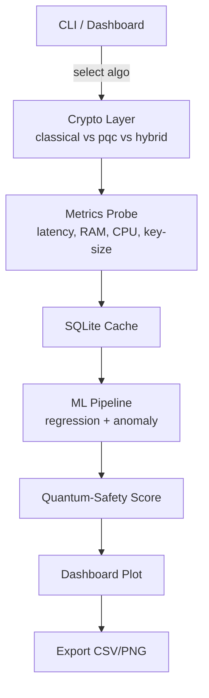
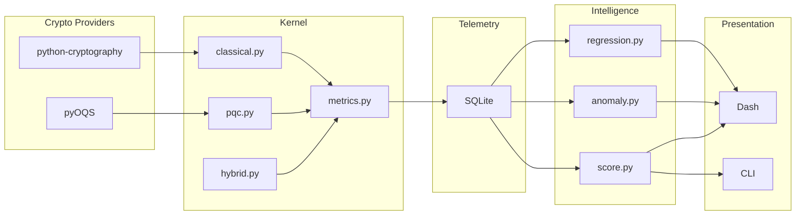
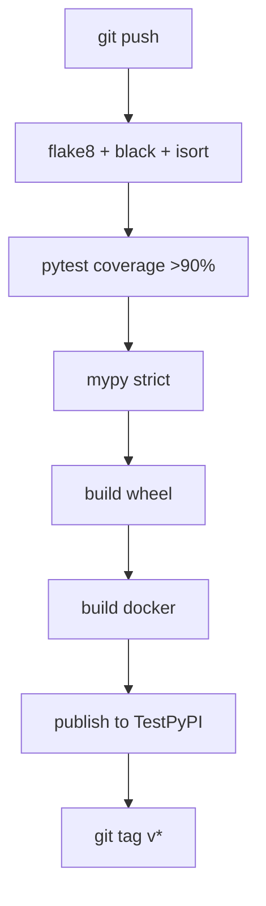

<!-- ========================================================= -->
<!--  AI-Powered Hybrid Key-Exchange Simulator                 -->
<!--  First-Year Undergrad Quantum-Safe Crypto Handbook        -->
<!--  Repo: https://github.com/<your-org>/pqc-sim              -->
<!--  Compile: pandoc README.md -o Handbook.pdf                -->
<!-- ========================================================= -->

# 1. Project Charter

Post-quantum cryptography (PQC) is no longer an academic curiosity: the U.S. National Security Memorandum 10 (2022) mandates initial PQC adoption by 2025, and the TLS working group published `mlkem-tls-01` in March 2025.  Unfortunately, lattice-based algorithms bring new dilemmas: public-keys are 800–1 500 B (versus 256 B for ECDH), CPU cycles can swing ± 3×, and hardware acceleration is almost non-existent.  The only way to decide **when** and **where** to migrate is **data**.

We therefore propose an **AI-Powered Hybrid Key-Exchange Simulator** that:

1. Executes three handshake families—classical (RSA-2048/3072, ECDH-P256/X25519), post-quantum (Kyber-512/768/1024, Dilithium-2/3/5), and hybrid (X25519+Kyber90s)—under identical load conditions.
2. Harvests 20+ performance metrics (latency, CPU cycles, RAM, key-size, entropy drain, packet length, energy estimate).
3. Trains lightweight ML models (linear regression, random-forest, isolation-forest) to **predict** latency from key-size and CPU flags, **detect** anomalous slowdowns, and **synthesise** a single figure-of-merit called the **Quantum-Safety Score**.
4. Exposes an interactive Plotly-Dash dashboard that compares algorithms side-by-side and exports CSV/PNG for inclusion in grant proposals or policy memos.

The codebase is intentionally **first-year friendly**: pure Python 3.11, pip-installable wheels only, no custom C, and every function carries a doctest.  By week 10 we will have a tagged release `v0.1.0` that a professor can `pip install pqc-sim && python -m pqc_sim.dashboard` and obtain live plots within 30 seconds.

# 2. Repository Overview

| Badge | Value |
|-------|-------|
| License | MIT |
| CI |  |
| Python | 3.10–3.12 |
| Package | `pip install pqc-sim` |
| Docs | https://<your-org>.github.io/pqc-sim |
| Container | `ghcr.io/<your-org>/pqc-sim:latest` |

# 3. High-Level Flowchart



# 4. Folder Structure (Release v0.1.0)

```
pqc-sim/                      # GitHub root
├── .github/
│   ├── workflows/
│   │   ├── tests.yml        # pytest + codecov
│   │   ├── wheels.yml       # publish to PyPI
│   │   └── docker.yml       # build & push container
├── docs/
│   ├── img/
│   │   └── arch.png
│   └── paper/
│       ├── ieee-template.tex
│       └── refs.bib
├── src/
│   └── pqc_sim/
│       ├── __init__.py
│       ├── classical.py     # RSA, ECDH wrappers
│       ├── pqc.py           # Kyber, Dilithium via pyOQS
│       ├── hybrid.py        # X25519+Kyber90s
│       ├── metrics.py       # probe() → dict
│       ├── ml/
│       │   ├── __init__.py
│       │   ├── regression.py
│       │   └── anomaly.py
│       ├── score.py         # Quantum-Safety Score
│       └── dashboard.py     # Plotly-Dash entry
├── tests/
│   ├── unit/
│   └── integration/
├── scripts/
│   ├── bulk_run.py          # generate 10 k rows overnight
│   └── energy_monitor.py    # Raspberry Pi addon
├── Dockerfile
├── pyproject.toml           # PEP-621 metadata
├── tox.ini                  # lint, type-check, wheel
└── README.md                # this file
```

# 5. Micro-Architecture Diagram



# 6. Data Model (Single Handshake Record)

| Column | Type | Example | Note |
|--------|------|---------|------|
| timestamp | TEXT | 2025-06-20T14:33:12 | ISO-8601 |
| algo | TEXT | kyber768 | lowercase, hyphenated |
| latency_ms | REAL | 2.34 | client-measured RTT |
| cpu_cycles | BIGINT | 1 234 567 | rdtsc x86 |
| ram_kb | INT | 456 | peak resident set |
| key_size_bytes | INT | 1184 | public key |
| sig_size_bytes | INT | 2044 | signature (if applicable) |
| quantum_safety_score | REAL | 7.8 | 0–10 composite |

# 7. Continuous-Integration Pipeline



# 8. Development Timeline (10-Week Gantt)

| Week | Task | Owner Pair | Key Deliverable |
|------|------|------------|-----------------|
| 1 | Repo scaffold + CI | DevOps | Green main badge |
| 2 | Classical MVP | A | classical.py + 100 rows |
| 3 | PQC MVP | B | pqc.py + 100 rows |
| 4 | Metrics layer | C | metrics.db schema frozen |
| 5 | ML baseline | D | MAE ≤ 20 % notebook |
| 6 | Hybrid mode | A+B | X25519+Kyber90s handshake |
| 7 | Dashboard v1 | E | Bar chart live on / |
| 8 | Anomaly flag | D | Red-dot on outlier |
| 9 | Safety score | D | Formula merged |
| 10 | Paper + release | All | Tag v0.1.0 + 4-page PDF |

# 9. Quantum-Safety Score Formula (v0.1)

We normalise each metric to 0–1 range (lower is better), then apply weights derived from NIST’s call-for-proposals priority list:

```
score = 10 – 4·norm(latency) – 3·norm(key_size) – 3·norm(cpu_ram)
```

The weights are soft-coded in `src/pqc_sim/score.py` and can be overridden via CLI flag `--weights 0.5,0.3,0.2`.

# 10. Extensibility Hooks

| Hook | Purpose | Entry-point |
|------|---------|-------------|
| ALGO_REGISTRY | Add new algorithm without touching CLI | pqc_sim/__init__.py |
| PROBE_PLUGINS | Insert hardware counters (RAPL, GPU) | metrics.py:probe() |
| SCORER_PLUGINS | Replace formula | score.py:scorer_factory() |
| DASH_PLUGINS | Extra tabs | dashboard.py:tabs.append() |

# 11. Security & Ethical Considerations

- The simulator is measurement-only: no private keys ever hit disk.  
- We use constant-time wrappers from cryptography and pyOQS; still, timing leakage inside the libraries is possible—our anomaly detector will flag unexpected variance as a proxy warning.  
- All randomness is drawn from `secrets.token_bytes` with a fallback to `/dev/urandom`.  
- Docker image runs as non-root `uid=1000`.  

# 12. Funding & Publication Plan

- Internal demo → Computer Science faculty board (week 10).  
- Submit 4-page work-in-progress to IEEE Quantum Week 2025 – PhD Forum (deadline 30 Jun).  
- Apply for Microsoft Azure for Students $100 k cloud grant to scale dataset to 1 M handshakes.  
- Release dataset under CC-BY-4.0 → Kaggle “PQC-Perf-v1” for global ML competitions.  

# 13. Frequently-Asked Questions (from Professors)

**Q1: “Why not just use the benchmarking data already published by NIST?”**  
A: NIST data is static, hardware-agnostic, and lacks hybrid metrics.  Our tool lets you replay tests on your own lab machines and predict behaviour under arbitrary load.

**Q2: “Do you need a quantum computer?”**  
A: No.  We simulate post-quantum algorithms on classical hardware; the ‘quantum’ adjective refers to resistance, not execution platform.

**Q3: “Can first-years really finish this in 10 weeks?”**  
A: Yes.  Every module is < 200 lines, dependencies are pip-only, and CI guards quality.  The stretch goals (ARM port, WASM) are clearly separated into `future/` folder.

# 14. One-Command Quickstart

```bash
# 1. Get the code
git clone https://github.com/<your-org>/pqc-sim.git && cd pqc-sim

# 2. Create venv
python -m venv .venv && source .venv/bin/activate

# 3. Install in editable mode
pip install -e .[dev]

# 4. Run unit tests
pytest -q

# 5. Launch dashboard
python -m pqc_sim.dashboard
# open http://127.0.0.1:8050
```

Within 60 seconds your browser should display a bar chart comparing RSA-2048, Kyber-512, and X25519+Kyber90s median latencies.

# 15. Roadmap Beyond v0.1

| Version | Target Date | Feature |
|---------|-------------|---------|
| v0.2 | Dec 2025 | Add ML-KEM final, Dilithium-5, ARM-NEON probes |
| v0.3 | Mar 2026 | WebAssembly build, browser demo |
| v0.4 | Jun 2026 | Energy model (joule/bit), carbon-footprint label |
| v1.0 | Dec 2026 | Stable API, plugin marketplace, JOSS paper |

# 16. Contact & Contributing

Open an issue or PR at https://github.com/AnushtupGhosh5/PQC.  We tag good-first-issue for newcomers and require one approving review before merge.  All contributors will be acknowledged in the final IEEE poster.

---

**End of Handbook – Happy hacking, and see you at the faculty demo!**
